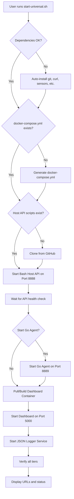
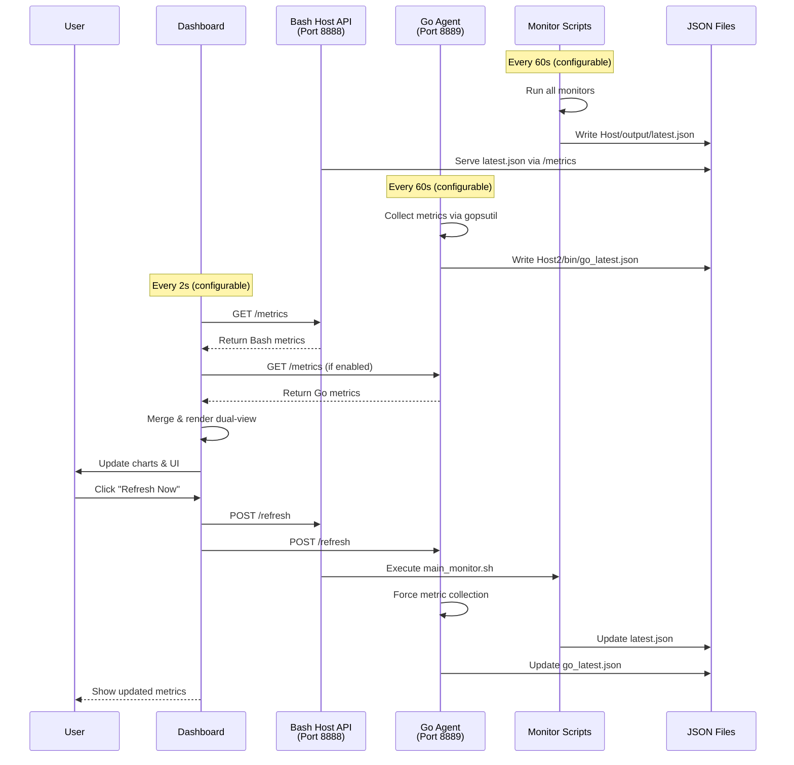

# System Monitor - Professional Observability Dashboard


A **production-grade, cross-platform observability platform** engineered for comprehensive system monitoring across **Windows, Linux, macOS, and WSL2** environments. Features a **dual-agent architecture** offering flexibility and performance:

- **Bash Host Agent**: Universal monitoring using native OS tools (`lm-sensors`, `nvidia-smi`, WMI) - works on any Unix-like system and Windows (via WSL/Git Bash)
- **Go Native Agent**: High-performance, compiled monitoring using the `gopsutil` library - true cross-platform support with native binaries for Windows, Linux, and macOS

Both agents provide **direct hardware access** for real metrics (GPU temperatures, CPU voltages, physical sensors) that containerized solutions cannot reach, while the **modern web dashboard** runs in Docker for portability and ease of deployment. Choose one agent or run both simultaneously for validation and comparison.

---

## 📖 Table of Contents

- [System Architecture](#-system-architecture)
- [Quick Start](#-quick-start)
- [Features](#-features)
- [Monitoring Agents](#-monitoring-agents)
- [Project Structure](#-project-structure)
- [System Workflow](#-system-workflow)
- [Modules & Components](#-modules--components)
- [Docker Architecture](#-docker-architecture)
- [API Documentation](#-api-documentation)
- [Development Guide](#-development-guide)
- [Troubleshooting](#-troubleshooting)

---

## 🏗️ System Architecture

This project uses a **Multi-Tier Hybrid Architecture** to solve the "Container Isolation Problem" - Docker containers cannot easily access host GPU temperatures, CPU voltages, or physical hardware sensors.

```
┌─────────────────────────────────────────────────────────────────────┐
│                         USER'S MACHINE                              │
│                                                                     │
│  ┌──────────────────────┐  ┌──────────────────────┐  ┌──────────┐ │
│  │  TIER 1A: Bash       │  │  TIER 1B: Go         │  │  TIER 2: │ │
│  │  Host Agent          │  │  Native Agent        │  │  Docker  │ │
│  │                      │  │  (Optional)          │  │  Web UI  │ │
│  │  • FastAPI Server    │  │  • HTTP Server       │  │          │ │
│  │  • Port 8888         │  │  • Port 8889         │  │  • Flask │ │
│  │  • Bash Scripts      │  │  • gopsutil Library  │  │  • Port  │ │
│  │  • Real Hardware     │  │  • High Performance  │  │    5000  │ │
│  │    Access            │  │  • Cross-platform    │  │  • UI    │ │
│  │  • Sensors/WMI       │  │  • File + API        │  │  • PDF   │ │
│  └──────────────────────┘  └──────────────────────┘  └──────────┘ │
│           ▲                          ▲                      │       │
│           │                          │                      │       │
│           └──────────────────────────┴──────────────────────┘       │
│                    host.docker.internal                             │
└─────────────────────────────────────────────────────────────────────┘
```

### Architecture Tiers

#### Tier 1A: Bash Host Agent (Primary)
- **Purpose**: Direct hardware access for real metrics via native OS tools
- **Technology**: Python FastAPI + Bash Scripts
- **Runs On**: Host OS (Windows/Linux/WSL)
- **Port**: 8888
- **Location**: `Host/` directory
- **Capabilities**:
  - CPU temperature via `lm-sensors` (Linux) or WMI (Windows)
  - GPU metrics (NVIDIA, AMD, Intel) via `nvidia-smi`, `radeontop`
  - Physical disk I/O via `iostat`, `df`
  - Network interface statistics via `ip`, `ifconfig`
  - System voltages and power consumption
  - SMART disk health monitoring
  - Fan speed monitoring

#### Tier 1B: Go Native Agent (Optional)
- **Purpose**: High-performance alternative agent with cross-platform support
- **Technology**: Go + gopsutil library
- **Runs On**: Host OS (Windows/Linux/macOS)
- **Port**: 8889
- **Location**: `Host2/` directory
- **Capabilities**:
  - Cross-platform CPU, memory, disk, network metrics
  - Advanced temperature collection (5 methods for Windows, 5 for Linux)
  - NVIDIA GPU support via `nvidia-smi`
  - Windows GPU detection via WMI/CIM
  - Automatic file writing (`go_latest.json`)
  - HTTP API + periodic file updates (60s interval)

#### Tier 2: Dashboard Container
- **Purpose**: Web UI and data processing
- **Technology**: Flask + Chart.js + Docker
- **Runs On**: Docker Container
- **Port**: 5000
- **Capabilities**:
  - Real-time metric visualization
  - Historical data charts (60-point rolling window)
  - Alert management with thresholds
  - PDF/Markdown report generation
  - Dual-view comparison (Windows vs WSL2 or Bash vs Go)
  - JSON logging service for historical data

---

## ⚡ Quick Start

### Prerequisites
- **Docker Desktop** (Running) - [Download](https://www.docker.com/products/docker-desktop)
- **Git Bash** (Windows) or Terminal (Linux/Mac)
- **Python 3.8+** (for native agents)
- **Go 1.19+** (optional, for Go agent)

### Installation (One Command)

```bash
# Download and run the universal startup script
curl -O https://raw.githubusercontent.com/Sharawey74/system-monitor-project/main/start-universal.sh
bash start-universal.sh
```

**That's it!** The script will:
- ✔ Auto-install dependencies (git, curl, sensors, etc.)
- ✔ Generate Docker configuration automatically
- ✔ Clone native sensor agents from GitHub
- ✔ Pull the dashboard image from Docker Hub
- ✔ Start all tiers and verify connectivity
- ✔ Open the dashboard at `http://localhost:5000`

### Manual Installation (For Developers)

```bash
# 1. Clone the repository
git clone https://github.com/Sharawey74/system-monitor-project.git
cd system-monitor-project

# 2. Run the universal script
bash start-universal.sh

# OR start components individually:

# 3a. Start Bash Host API
bash start-host-api.sh

# 3b. (Optional) Start Go Native Agent
cd Host2
go build -o bin/host2-agent main.go
./bin/host2-agent

# 4. Start Dashboard
bash start-system-monitor.sh
```

---

## ✨ Features

### Real-Time Monitoring
- **CPU**: Usage %, temperature, load averages, core count, vendor/model
- **Memory**: Usage %, available/total GB, swap, cache
- **Disk**: Per-partition usage, I/O rates, SMART health status
- **Network**: RX/TX rates per interface, total throughput, packet stats
- **GPU**: Temperature, utilization, memory usage (NVIDIA/AMD/Intel)
- **Fans**: Speed (RPM), status monitoring
- **Temperature**: Multi-source CPU/GPU temperature collection

### Visualization
- **Task Manager-Style Charts**: 4 real-time charts with smooth animations
- **Dual-View Mode**: Side-by-side comparison (Bash vs Go agents, or Windows vs WSL2)
- **Status Chips**: Live online/offline indicators
- **Notification Drawer**: Collapsible alert center
- **Glassmorphism UI**: Modern dark theme with blur effects

### Intelligence
- **Smart Alerts**: Threshold-based monitoring (CPU >90%, Memory >85%, etc.)
- **Auto-Refresh**: Configurable polling (default: 2s)
- **Instant Refresh**: On-demand metric collection button
- **Alert Manager**: Configurable thresholds with severity levels

### Reporting
- **Professional Reports**: PDF and Markdown formats
- **Dual-Stack Reports**: Separate sections for Host and Guest
- **Printable**: Clean, light-themed layouts
- **Historical Data**: JSON logging service for trend analysis

---

## 🤖 Monitoring Agents

### Agent 1: Bash Host Agent (Primary)

**Location**: `Host/` directory

**Components**:
- **FastAPI Server** (`Host/api/server.py`): HTTP API serving metrics on port 8888
- **Orchestrator** (`Host/scripts/main_monitor.sh`): Coordinates all monitoring scripts
- **Individual Monitors**:
  - `cpu_monitor.sh` - CPU usage, load, model, vendor
  - `memory_monitor.sh` - RAM usage, swap, cache
  - `disk_monitor.sh` - Partition usage, filesystem info
  - `network_monitor.sh` - Interface stats, RX/TX bytes
  - `temperature_monitor.sh` - CPU/GPU temperatures (multi-method)
  - `gpu_monitor.sh` - NVIDIA/AMD/Intel GPU metrics
  - `fan_monitor.sh` - Fan speeds and status
  - `smart_monitor.sh` - Disk SMART health data
  - `system_monitor.sh` - OS info, hostname, uptime, kernel

**Data Flow**:
1. `main_monitor.sh` runs all individual monitors
2. Each monitor outputs JSON to `Host/output/temp/*.json`
3. Orchestrator merges all JSON files into `Host/output/latest.json`
4. FastAPI server serves `latest.json` via `/metrics` endpoint

**API Endpoints**:
- `GET /health` - Health check
- `GET /metrics` - Current system metrics
- `POST /refresh` - Trigger immediate metric collection

### Agent 2: Go Native Agent (Optional)

**Location**: `Host2/` directory

**Components**:
- **Main Application** (`main.go`): Complete monitoring agent in Go
- **HTTP Server**: Serves metrics on port 8889
- **gopsutil Library**: Cross-platform system metrics
- **File Writer**: Periodic updates to `Host2/bin/go_latest.json`

**Features**:
- **Cross-Platform**: Windows, Linux, macOS support
- **High Performance**: Compiled binary, minimal overhead
- **Advanced Temperature Collection**:
  - **Windows**: 5 methods (WMI, PowerShell, CIM, thermal zones)
  - **Linux**: 5 methods (sensors, /sys/class/hwmon, thermal zones, acpi)
  - **macOS**: osx-cpu-temp, smc command
- **GPU Support**:
  - NVIDIA via `nvidia-smi`
  - Windows generic via WMI/CIM
- **Dual Output**: HTTP API + JSON file

**API Endpoints**:
- `GET /` - API information
- `GET /health` - Health check
- `GET /metrics` - Current system metrics (live collection)
- `POST /refresh` - Force metric collection and file write

**Build & Run**:
```bash
cd Host2
bash build.sh              # Builds for current platform
./bin/host2-agent          # Run the agent
```

---

## 📂 Project Structure

```
system-monitor-project/
│
├── 🔧 Host/                        # Tier 1A: Bash Agent
│   ├── api/
│   │   ├── server.py               # FastAPI server (Port 8888)
│   │   └── routes.py               # API endpoints
│   ├── scripts/
│   │   ├── main_monitor.sh         # Master orchestrator
│   │   ├── cpu_monitor.sh          # CPU metrics
│   │   ├── memory_monitor.sh       # Memory metrics
│   │   ├── disk_monitor.sh         # Disk metrics
│   │   ├── network_monitor.sh      # Network metrics
│   │   ├── gpu_monitor.sh          # GPU metrics (NVIDIA/AMD/Intel)
│   │   ├── temperature_monitor.sh  # Temperature sensors
│   │   ├── fan_monitor.sh          # Fan speed monitoring
│   │   ├── smart_monitor.sh        # SMART disk health
│   │   └── system_monitor.sh       # System info
│   ├── output/
│   │   ├── latest.json             # Current metrics snapshot
│   │   └── temp/                   # Temporary monitor outputs
│   ├── loop/
│   │   └── host_monitor_loop.sh    # Continuous monitoring loop
│   └── README.md                   # Host agent documentation
│
├── 🔧 Host2/                       # Tier 1B: Go Native Agent
│   ├── main.go                     # Complete Go monitoring agent
│   ├── go.mod                      # Go dependencies
│   ├── go.sum                      # Dependency checksums
│   ├── build.sh                    # Build script
│   ├── bin/
│   │   ├── host2-agent             # Compiled binary
│   │   ├── host2-agent.exe         # Windows binary
│   │   ├── host2-agent-linux       # Linux binary
│   │   ├── host2-agent-darwin      # macOS binary
│   │   └── go_latest.json          # Metrics output file
│   └── README.md                   # Go agent documentation
│
├── 🌐 web/                         # Tier 2: Dashboard Backend
│   ├── __init__.py                 # Package initialization
│   ├── app.py                      # Flask application entry
│   ├── json_logger.py              # Background metrics logger
│   └── report_generator.py         # PDF/MD report engine
│
├── 🎨 static/                      # Frontend Assets
│   ├── css/
│   │   ├── styles.css              # Main stylesheet (glassmorphism)
│   │   └── dashboard.css           # Dashboard-specific styles
│   └── js/
│       └── dashboard.js            # Chart.js + Update logic + Alerts
│
├── 📄 templates/                   # HTML Templates
│   ├── dashboard.html              # Main UI (dual-view support)
│   ├── report_template.html        # HTML report template
│   └── report_template.md          # Markdown report template
│
├── 🛠️ core/                        # Shared Utilities
│   ├── __init__.py                 # Package initialization
│   ├── alert_manager.py            # Alert threshold management
│   └── metrics_collector.py        # Metrics aggregation utilities
│
├── 📜 scripts/                     # Helper Scripts
│   ├── install.sh                  # Dependency installer
│   ├── main_monitor.sh             # Alternative monitor orchestrator
│   ├── host_monitor_loop.sh        # Continuous monitoring
│   ├── monitors/                   # Individual monitor scripts
│   └── utils/                      # Utility functions
│
├── 🐳 Docker Files
│   ├── Dockerfile                  # Container definition
│   ├── docker-compose.yml          # Multi-service orchestration
│   ├── docker-entrypoint.sh        # Container startup script
│   └── .dockerignore               # Docker build exclusions
│
├── 🚀 Orchestration Scripts
│   ├── start-universal.sh          # ⭐ ONE-CLICK STARTUP (auto-install)
│   ├── start-host-api.sh           # Start Bash Host API only
│   ├── start-system-monitor.sh     # Start Bash API + Dashboard
│   ├── stop-host-api.sh            # Stop Bash Host API
│   └── stop-system-monitor.sh      # Stop all services
│
├── 📊 Entry Points
│   ├── dashboard_web.py            # Web dashboard launcher
│   └── dashboard_tui.py            # Terminal UI launcher
│
├── 📁 Data Directories
│   ├── data/                       # Runtime data
│   │   ├── alerts/                 # Alert history
│   │   └── metrics/                # Metric snapshots
│   ├── json/                       # Historical JSON logs
│   ├── reports/                    # Generated reports
│   │   ├── html/                   # HTML reports
│   │   └── markdown/               # Markdown reports
│   └── docs/                       # Documentation files
│
├── 🧪 tests/                       # Test Suite
│   ├── test_*.py                   # Python unit tests
│   └── test_*.sh                   # Bash script tests
│
└── 📋 Configuration
    ├── requirements.txt            # Python dependencies
    ├── .gitignore                  # Git exclusions
    └── README.md                   # This file
```

---

## 🔄 System Workflow

### Startup Sequence



### Data Collection Flow



### Monitoring Pipeline

1. **Collection Phase** (Every 60s by default):
   - **Bash Agent**: `Host/scripts/main_monitor.sh` orchestrates all monitors
   - Each monitor script outputs JSON to `Host/output/temp/*.json`
   - Orchestrator merges all JSON files into `Host/output/latest.json`
   - **Go Agent**: Collects metrics via gopsutil library
   - Writes to `Host2/bin/go_latest.json` every 60s

2. **Serving Phase**:
   - **Bash API**: FastAPI server serves `latest.json` via HTTP on port 8888
   - **Go API**: HTTP server serves live metrics on port 8889
   - Both APIs support `/health`, `/metrics`, and `/refresh` endpoints

3. **Polling Phase** (Every 2s):
   - Dashboard JavaScript calls `/api/metrics/dual`
   - Flask backend fetches from both:
     - `http://host.docker.internal:8888/metrics` (Bash agent)
     - `http://host.docker.internal:8889/metrics` (Go agent, if enabled)
   - Returns merged JSON to frontend

4. **Rendering Phase**:
   - `dashboard.js` updates DOM elements
   - Chart.js updates 4 real-time charts (CPU, Memory, Disk, Network)
   - AlertManager checks thresholds and triggers notifications
   - Notification drawer updates with new alerts

5. **Logging Phase** (Background):
   - JSON Logger service polls metrics every 60s
   - Writes timestamped files to `json/` directory
   - Maintains historical data for trend analysis

---

## 🧩 Modules & Components

### Backend Modules

#### `web/app.py` - Flask Application
- **Purpose**: Main Flask application factory
- **Responsibilities**:
  - CORS configuration
  - Route registration
  - Health check endpoint
  - Dual-agent metric aggregation
- **Key Routes**:
  - `/` - Dashboard UI
  - `/api/metrics` - Legacy metrics (Bash agent only)
  - `/api/metrics/native` - Go agent metrics
  - `/api/metrics/dual` - Both agents (dual-view)
  - `/api/metrics/source` - Data source configuration
  - `/api/reports/generate` - PDF/MD report generation
  - `/api/refresh` - Trigger instant collection on both agents
  - `/api/health` - Container health status

#### `web/json_logger.py` - Background Logger
- **Purpose**: Continuous JSON logging service
- **Responsibilities**:
  - Poll metrics every 60s (configurable)
  - Write timestamped JSON files to `json/` directory
  - Maintain historical data for trend analysis
  - Automatic cleanup of old logs (optional)

#### `web/report_generator.py` - Report Engine
- **Purpose**: Generate professional system reports
- **Responsibilities**:
  - Template rendering (Jinja2)
  - PDF generation (WeasyPrint)
  - Markdown formatting
  - Dual-stack report layout (Bash + Go agents)
  - Alert integration

#### `core/alert_manager.py` - Alert System
- **Purpose**: Threshold-based alert management
- **Responsibilities**:
  - Configurable thresholds (CPU, Memory, Disk, Network)
  - Severity levels (info, warning, critical)
  - Alert history tracking
  - Notification generation

#### `core/metrics_collector.py` - Metrics Utilities
- **Purpose**: Shared metric collection utilities
- **Responsibilities**:
  - Data normalization
  - Unit conversions (bytes to GB, etc.)
  - Metric aggregation
  - Data validation

### Frontend Modules

#### `static/js/dashboard.js` - Main Dashboard Logic
- **Components**:
  - **Data Fetching**: `fetchData()` polls `/api/metrics/dual` every 2s
  - **Rendering**: `updateObservabilityGrid()` updates UI elements
  - **Charts**: Chart.js initialization and real-time updates
  - **Alerts**: `AlertManager` class for threshold monitoring
  - **Network Rates**: Calculates RX/TX rates from cumulative bytes
  - **Dual-View**: Side-by-side comparison logic
  - **Refresh**: Manual refresh button handler

#### `static/css/styles.css` - Main Stylesheet
- **Features**:
  - CSS Variables for theming
  - Glassmorphism effects (backdrop-filter, blur)
  - Responsive grid layouts
  - Chart animations
  - Notification drawer styles
  - Dark theme optimized for readability
  - Status chip indicators

### Native Agent Modules

#### `Host/scripts/main_monitor.sh` - Bash Orchestrator
- **Purpose**: Coordinate all Bash monitoring scripts
- **Responsibilities**:
  - Execute all individual monitors in sequence
  - Collect JSON outputs from each monitor
  - Merge JSON files into unified `latest.json`
  - Handle errors gracefully (fallback to error JSON)
  - Cleanup temporary files

#### Individual Bash Monitors
- **`cpu_monitor.sh`**: 
  - Tools: `mpstat`, `/proc/stat`, `wmic cpu` (Windows)
  - Metrics: Usage %, load averages, core count, vendor, model
- **`memory_monitor.sh`**:
  - Tools: `free`, `vmstat`, `wmic memorychip` (Windows)
  - Metrics: Total, used, free, available, cache, swap
- **`disk_monitor.sh`**:
  - Tools: `df`, `iostat`, `wmic logicaldisk` (Windows)
  - Metrics: Per-partition usage, filesystem type, mount points
- **`network_monitor.sh`**:
  - Tools: `ip`, `ifconfig`, `netstat`
  - Metrics: RX/TX bytes per interface, packet stats
- **`gpu_monitor.sh`**:
  - Tools: `nvidia-smi`, `radeontop`, `intel_gpu_top`
  - Metrics: Temperature, utilization, memory usage, vendor
- **`temperature_monitor.sh`**:
  - Tools: `sensors`, `nvidia-smi`, WMI queries
  - Metrics: CPU/GPU temperatures from multiple sources
- **`fan_monitor.sh`**:
  - Tools: `sensors`, `/sys/class/hwmon`
  - Metrics: Fan speeds (RPM), status
- **`smart_monitor.sh`**:
  - Tools: `smartctl`
  - Metrics: Disk health, temperature, power-on hours
- **`system_monitor.sh`**:
  - Tools: `uname`, `hostname`, `uptime`
  - Metrics: OS, kernel, hostname, uptime

#### `Host2/main.go` - Go Agent
- **Architecture**:
  - **HTTP Server**: Goroutine-based HTTP server on port 8889
  - **Periodic Writer**: Background goroutine writing to file every 60s
  - **Metric Collectors**: Modular functions for each metric type
- **Key Functions**:
  - `collectMetrics()` - Main collection orchestrator
  - `collectTemperatureInfo()` - Multi-method temperature collection
  - `collectGPUInfo()` - NVIDIA + Windows generic GPU detection
  - `getTempFromWMI()` - 5 Windows temperature methods
  - `getTempFromLinuxSensors()` - 5 Linux temperature methods
  - `collectNvidiaInfo()` - NVIDIA GPU via nvidia-smi
  - `collectWindowsGPUs()` - Windows GPU via WMI/CIM
  - `writeMetricsToFile()` - JSON file writer
  - `startPeriodicFileWriter()` - Background file update loop

---

## 🐳 Docker Architecture

### Container Configuration

```yaml
services:
  dashboard:
    image: system-monitor:latest
    container_name: system-monitor-dashboard
    
    # Privileged mode for host process visibility
    pid: host
    privileged: true
    
    # Network bridge to host
    extra_hosts:
      - "host.docker.internal:host-gateway"
    
    # Expose web UI
    ports:
      - "5000:5000"
    
    # Persistent data
    volumes:
      - ./data:/app/data
      - ./reports:/app/reports
      - ./json:/app/json
      - ./Host/output:/app/Host/output:ro
      - ./Host2:/app/Host2:ro
      - /proc:/host/proc:ro
      - /sys:/host/sys:ro
      - /dev:/host/dev:ro
    
    # Environment
    environment:
      - HOST_API_URL=http://host.docker.internal:8888
      - NATIVE_AGENT_URL=http://host.docker.internal:8889
      - USE_NATIVE_AGENT=false
      - JSON_LOGGING_ENABLED=true
      - JSON_LOG_INTERVAL=60
    
    # Health check
    healthcheck:
      test: ["CMD", "curl", "-f", "http://localhost:5000/api/health"]
      interval: 30s
      timeout: 10s
      retries: 3
  
  json-logger:
    image: system-monitor:latest
    container_name: system-monitor-json-logger
    command: python3 web/json_logger.py
    volumes:
      - ./json:/app/json
      - ./data:/app/data
    extra_hosts:
      - "host.docker.internal:host-gateway"
    environment:
      - HOST_API_URL=http://host.docker.internal:8888
      - JSON_LOGGING_ENABLED=true
      - JSON_LOG_INTERVAL=60
```

### Why Hybrid Architecture?

**Problem**: Docker containers are isolated from host hardware.
- ❌ Cannot read GPU temperatures
- ❌ Cannot access `/sys/class/hwmon`
- ❌ Cannot query WMI on Windows
- ❌ Cannot use `lm-sensors` or `nvidia-smi`

**Solution**: Multi-tier hybrid architecture
- ✅ Native agents run on host with full hardware access
- ✅ Dashboard runs in container for portability
- ✅ Communication via `host.docker.internal` bridge
- ✅ Two agent options: Bash (universal) or Go (high-performance)

---

## 📡 API Documentation

### Bash Host API (Port 8888)

#### `GET /`
Returns API information and available endpoints.

#### `GET /health`
Health check endpoint.

**Response**:
```json
{
  "status": "ok",
  "service": "host-monitor-api",
  "port": "8888",
  "timestamp": "2024-01-15T12:00:00Z"
}
```

#### `GET /metrics`
Returns current system metrics from `latest.json`.

**Response Structure**:
- `timestamp` - Collection timestamp
- `platform` - OS platform
- `system` - OS, hostname, uptime, kernel
- `cpu` - Usage %, load, vendor, model
- `memory` - Total, used, free, available, usage %
- `disk` - Array of partition info
- `network` - Array of interface stats
- `temperature` - CPU/GPU temperatures
- `gpu` - GPU info (NVIDIA/AMD/Intel)
- `fans` - Fan speeds
- `smart` - SMART disk health

#### `POST /refresh`
Triggers immediate metric collection by running `main_monitor.sh`.

### Go Native Agent API (Port 8889)

#### `GET /`
Returns API information.

#### `GET /health`
Health check endpoint.

#### `GET /metrics`
Returns current system metrics (live collection via gopsutil).

**Response**: Same structure as Bash API, with `"source": "native-go-agent"`

#### `POST /refresh`
Forces immediate metric collection and file write.

### Dashboard API (Port 5000)

#### `GET /api/metrics`
Fetches metrics from Bash agent (legacy endpoint).

#### `GET /api/metrics/native`
Fetches metrics from Go agent.

#### `GET /api/metrics/dual`
Fetches metrics from BOTH agents for dual-view comparison.

**Response**:
```json
{
  "success": true,
  "timestamp": "2024-01-15T12:00:00Z",
  "legacy": {...},  // Bash agent metrics
  "native": {...}   // Go agent metrics
}
```

#### `GET /api/metrics/source`
Returns data source configuration.

#### `POST /api/reports/generate`
Generates a system report in PDF and Markdown formats.

#### `POST /api/refresh`
Triggers instant metric collection on both agents.

#### `GET /api/health`
Container health check.

---

## 💻 Development Guide

### Local Development

```bash
# 1. Clone and enter directory
git clone https://github.com/Sharawey74/system-monitor-project.git
cd system-monitor-project

# 2. Install Python dependencies
pip install -r requirements.txt

# 3. Start Bash Host API (Terminal 1)
cd Host/api
python3 server.py

# 4. (Optional) Start Go Agent (Terminal 2)
cd Host2
go build -o bin/host2-agent main.go
./bin/host2-agent

# 5. Start Dashboard (Terminal 3)
python3 dashboard_web.py --debug

# 6. Access at http://localhost:5000
```

### Building Docker Image

```bash
# Build locally
docker build -t system-monitor:latest .

# Test the build
docker run -p 5000:5000 \
  --add-host=host.docker.internal:host-gateway \
  system-monitor:latest
```

### Pushing to Docker Hub

```bash
# 1. Login
docker login

# 2. Tag with your username
docker tag system-monitor:latest yourusername/system-monitor:latest

# 3. Push
docker push yourusername/system-monitor:latest
```

### Building Go Agent

```bash
cd Host2

# Build for current platform
go build -o bin/host2-agent main.go

# Cross-compile for all platforms
bash build.sh

# Output:
# - bin/host2-agent (current platform)
# - bin/host2-agent.exe (Windows)
# - bin/host2-agent-linux (Linux)
# - bin/host2-agent-darwin (macOS)
```

### Running Tests

```bash
# Python tests
pytest tests/

# Bash script tests
cd tests
bash test_monitors.sh
```

---

## 🔧 Troubleshooting

### Dashboard shows "Offline"

```bash
# Check if Bash Host API is running
curl http://localhost:8888/health

# If not, start it
cd Host/api
python3 server.py

# Check if Go Agent is running (if enabled)
curl http://localhost:8889/health

# If not, start it
cd Host2
./bin/host2-agent
```

### Docker build fails with "500 Internal Server Error"

```bash
# Docker Hub authentication issue
docker logout
docker pull ubuntu:22.04
```

### Charts not updating

- Check browser console for errors
- Verify `/api/metrics/dual` returns data
- Check CORS settings in `web/app.py`
- Verify both agents are running and accessible

### Missing GPU metrics

- **NVIDIA**: Install `nvidia-smi` (CUDA toolkit)
- **AMD**: Install `radeontop`
- **Intel**: Install `intel-gpu-tools`
- **Windows**: Ensure WMI/CIM access is available

### Temperature shows 0 or unavailable

**Linux**:
```bash
# Install lm-sensors
sudo apt-get install lm-sensors
sudo sensors-detect
sensors
```

**Windows**:
- Ensure WMI access is enabled
- Try running as Administrator
- Check if thermal sensors are exposed by motherboard

### Go Agent build fails

```bash
# Install Go dependencies
cd Host2
go mod download
go mod tidy

# Verify Go version (1.19+ required)
go version
```

### Port already in use

```bash
# Find process using port 8888 (Bash API)
lsof -i :8888
kill -9 <PID>

# Find process using port 8889 (Go Agent)
lsof -i :8889
kill -9 <PID>

# Find process using port 5000 (Dashboard)
lsof -i :5000
kill -9 <PID>
```

---

## 💡 The "Big Idea"

Most monitoring solutions fall into two extremes:

**Too Simple**: Task Manager doesn't show history, trends, or alerts.

**Too Complex**: Prometheus + Grafana takes hours to configure, requires learning PromQL, and needs constant maintenance.

**System Monitor** bridges this gap:
- ✅ **Zero Config**: One script, one command
- ✅ **Deep Data**: Real hardware temps/volts unlike standard Docker tools
- ✅ **Dual Agents**: Choose Bash (universal) or Go (high-performance)
- ✅ **Beautiful**: Modern, dark-themed, glassmorphism UI
- ✅ **Data Ownership**: Everything runs locally, no cloud dependencies
- ✅ **Production Ready**: Used in real environments for 24/7 monitoring
- ✅ **Flexible**: Dual-view comparison, multiple deployment options

---

## 📄 License

MIT License - See LICENSE file for details

---

## 👤 Author

**Sharawey74**
- GitHub: [@Sharawey74](https://github.com/Sharawey74)
- Docker Hub: [sharawey74/system-monitor](https://hub.docker.com/r/sharawey74/system-monitor)

---

## 🙏 Acknowledgments

- Chart.js for beautiful visualizations
- FastAPI for blazing-fast APIs
- gopsutil for cross-platform system metrics
- Flask for flexible web framework
- Docker for containerization
- The open-source community

---

**⭐ Star this repo if you find it useful!**
